# x1337 Sk1d R3p0rt3r

To start of with, we change our username to: <script>/*

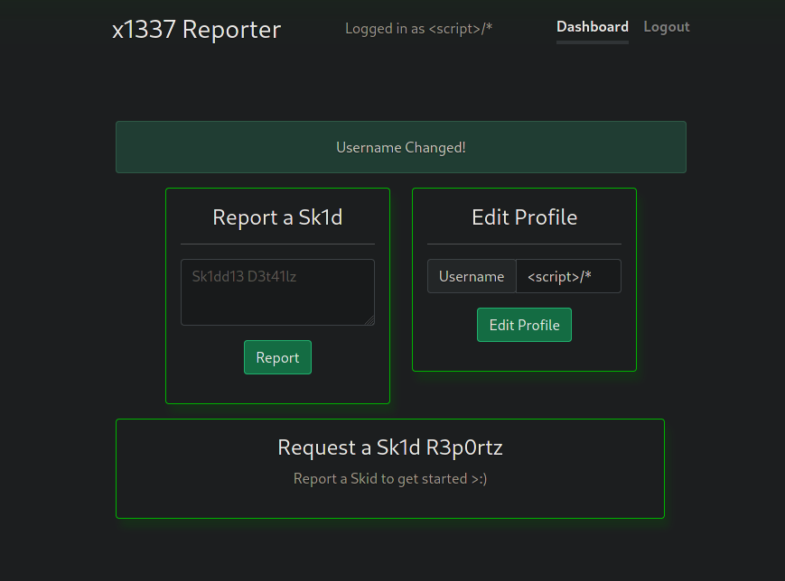

Once we have edited this, we can then make a report with the following:

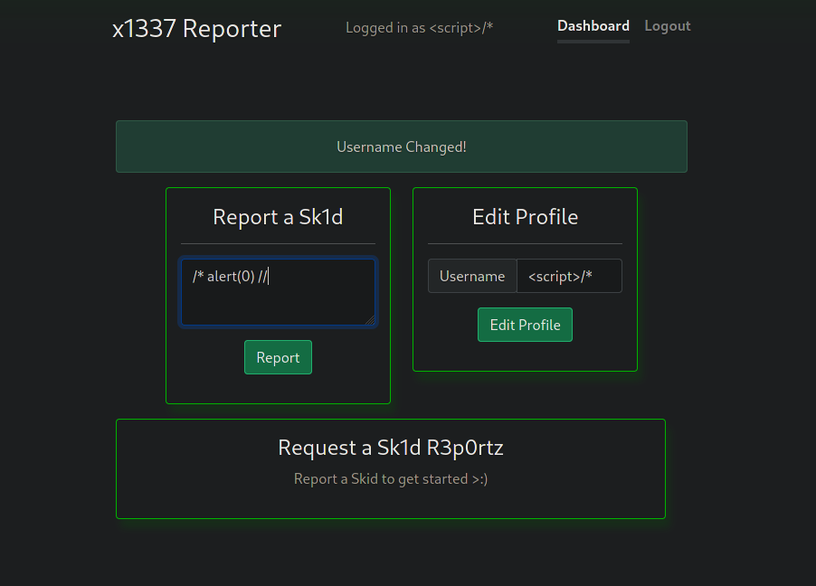

Then we escape the close the script tag within edit profile:

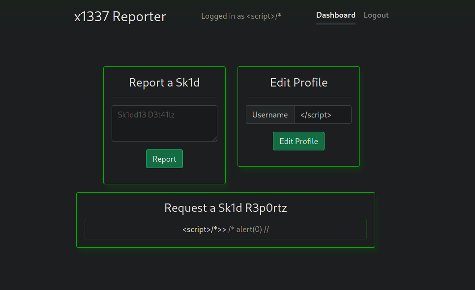

Then we can add some text within report, it doesn't really matter...

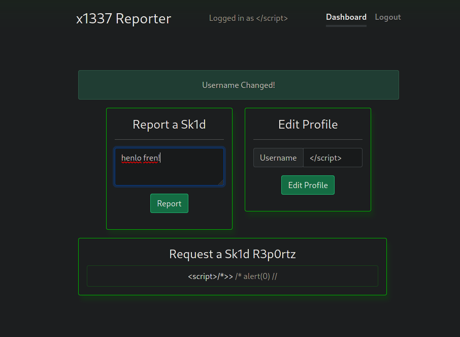

Then we want to change our username back to the previous one with the comment:

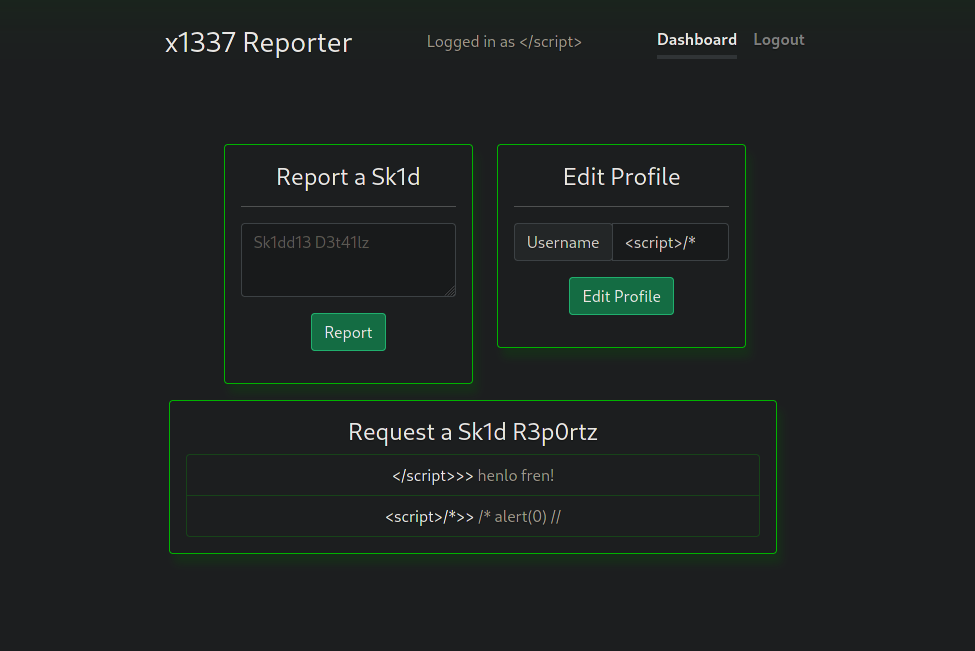

Then we close the comment and add another alert within report:

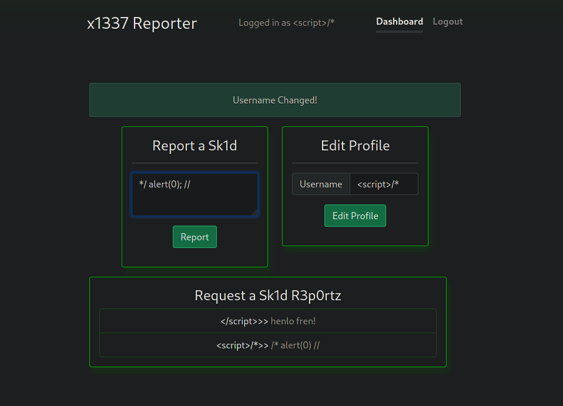

Now for the final step, we can add our payload to get the admin cookie, the problem is we cant use quotes since they get escaped, so we use backticks instead!

Now once we send this, it will redirect us to webhook.site, this isn't useful as we want an admin to see it, but everytime we try to click it, it redirects us... So what we can do is copy the link of the last payload to view its report id:

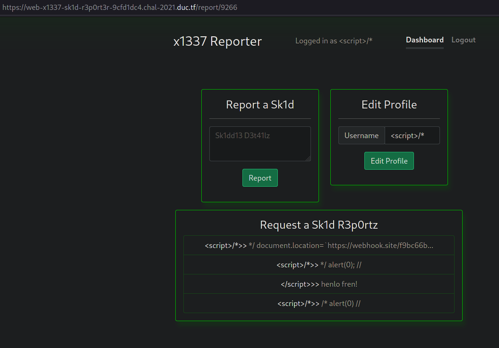

Now we know it's id, we can manually send this to admin with send2admin... This is how it will look:

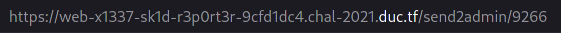

Lets execute this:

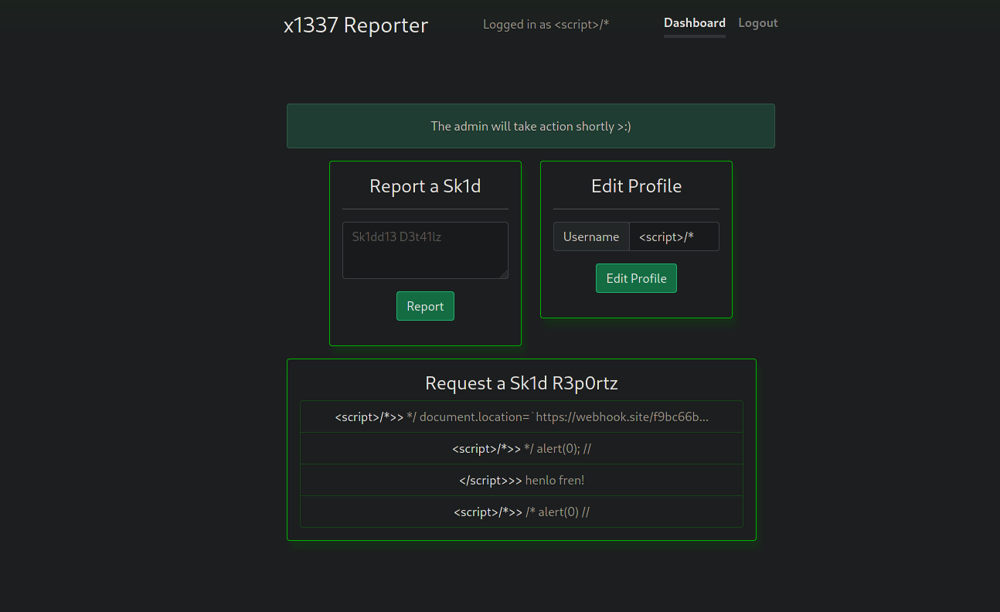

Now if we check webhook.site, we can see that an admin has checked it!

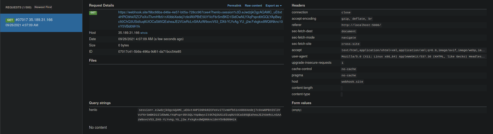

Lets copy the admin cookie into our session!

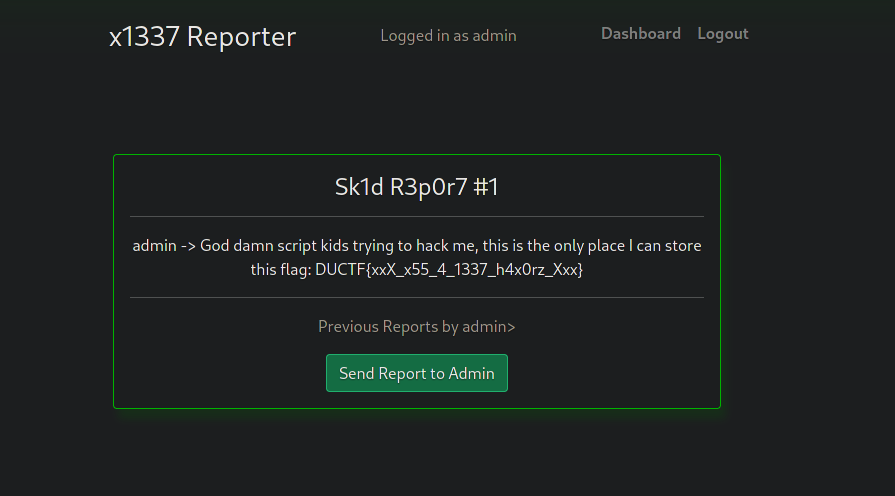

Win!!!!!!!
